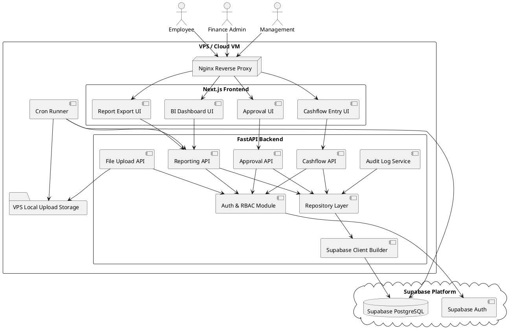
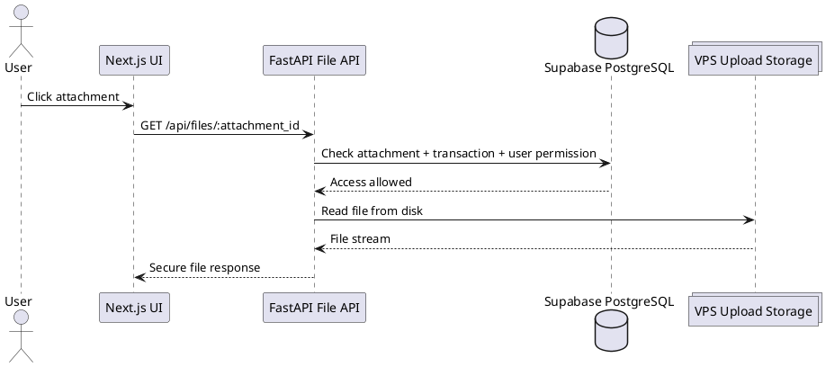
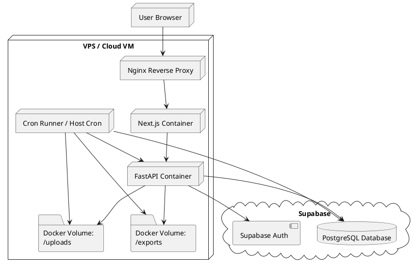
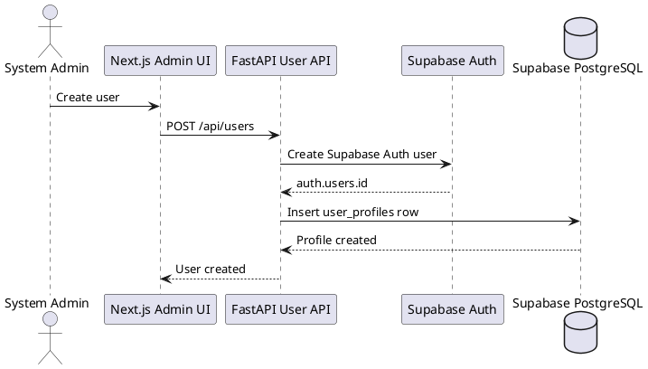
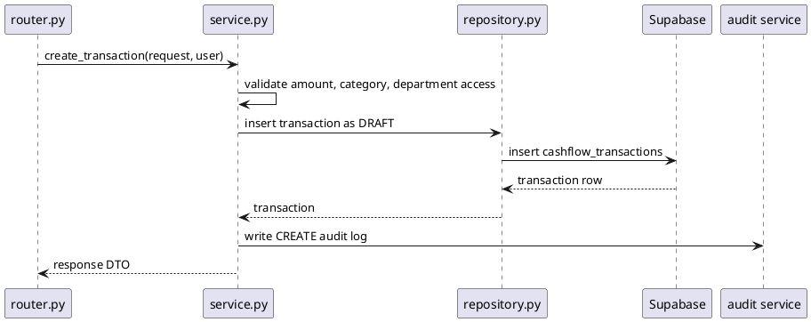

# SPEC-1-Financial Cashflow Recording and BI Reporting App

## Background

The company needs a centralized financial application to record, classify, review, and analyze cash inflows and outflows across business operations.

Currently, cashflow records may be managed through spreadsheets, manual bookkeeping, or disconnected finance tools, making it difficult to produce timely financial reports, monitor liquidity, track expenses, and understand business performance.

The proposed system will provide:

* A secure application for recording cashflow transactions.
* Categorization of income and expenses.
* Approval and audit tracking for financial entries.
* A BI dashboard for management-level reporting.
* Financial summaries such as cash position, income, expenses, profit/loss, and trends over time.

The MVP will focus on accurate cashflow recording, basic financial categorization, role-based access, and dashboard reporting for business decision-making.

## Requirements

### Must Have

* Users must be able to record cash inflows and cash outflows.
* Each transaction must include date, amount, type, category, payment method, description, and creator.
* Users must be able to attach supporting documents such as receipts, invoices, or bank transfer proofs.
* The system must support financial categories such as sales income, operational expense, payroll, vendor payment, loan, tax, and other custom categories.
* The system must provide role-based access control.
* Finance/admin users must be able to review, edit, approve, or reject transactions.
* The system must keep an audit trail of transaction changes.
* The dashboard must show cashflow summary by date range.
* The dashboard must show total income, total expense, net cashflow, and current cash balance.
* The dashboard must support filters by date, category, department, payment method, and transaction status.
* The system must generate basic financial reports such as cashflow report, income vs expense report, and category breakdown.

### Should Have

> **Note:** All "Should Have" features are **in scope for the MVP**. They must be implemented alongside the "Must Have" features before the MVP is considered complete.

* The system should support multi-department or cost-center tracking.
* The system should support recurring transactions (two modes: auto-submit and draft/reminder — see Method Section 7a).
* The system should allow exporting reports to Excel and PDF.
* The dashboard should include charts for monthly cashflow trends, top expense categories, and cash balance movement.
* The system should send notifications for pending approvals (in-app only — see Method Section 7b).
* The system should allow importing transactions from CSV or Excel files (Finance Admin only — see Method Section 7c).

### Could Have

> **Note:** All "Could Have" features are **explicitly deferred** until after the MVP is fully implemented.

* Bank statement upload and reconciliation.
* Budget vs actual reporting.
* Forecasting based on historical cashflow.
* Integration with accounting systems.
* Integration with bank APIs.
* Multi-currency support. (Schema fields `currency`, `exchange_rate`, and `base_amount` exist as future-proofing only. The MVP uses IDR with `exchange_rate = 1` and `base_amount = amount`.)
* Tax reporting support.

### Won’t Have in MVP

* Full double-entry accounting.
* Payroll processing.
* Automated tax filing.
* Real-time bank synchronization.
* AI-based anomaly detection.
* Complex enterprise ERP integration.

---

## Method

### 1. Architecture Approach

The MVP will be a responsive web application for a **single company with multiple departments**. It will support **simple cashflow accounting only**, where every approved transaction is classified as either:

* `INFLOW`
* `OUTFLOW`

The BI dashboard will be built inside the app using reporting APIs and Apache ECharts.

The application will use:

* **Next.js** for the responsive web frontend.
* **FastAPI** for backend APIs.
* **Supabase PostgreSQL** as the managed database.
* **No ORM**.
* A custom **Supabase client builder + repository pattern** for database access.
* **Supabase migrations** for schema versioning.
* **VPS local storage** for uploaded receipts and invoices.
* **Cron jobs** for scheduled reports, snapshot refreshes, cleanup, and backups.

FastAPI is suitable for this API layer because it is a production-ready Python web framework based on Python type hints. Its release notes show active maintenance, with FastAPI `0.138.0` released on June 20, 2026. Supabase is suitable as the database layer because it provides a hosted PostgreSQL database, instant APIs, authentication, and related backend platform features. Supabase also officially supports SQL-based database migrations for tracking schema changes over time.

### 2. MVP Technology Stack

| Layer               | Selected Choice       | Design Decision                                                                                                                                                             |
| ------------------- | --------------------- | --------------------------------------------------------------------------------------------------------------------------------------------------------------------------- |
| Frontend            | Next.js               | Responsive web app for desktop and mobile browser.                                                                                                                          |
| Backend API         | FastAPI               | Main business API, validation layer, authorization layer, reporting layer, and file access layer.                                                                           |
| Database            | Supabase PostgreSQL   | Managed PostgreSQL database hosted by Supabase.                                                                                                                             |
| ORM                 | No ORM                | Use Supabase Python client/query builder through repositories.                                                                                                              |
| Database Migrations | Supabase migrations   | SQL migration files versioned in Git and applied through Supabase CLI. Supabase documents migrations as SQL statements used to create, update, or delete schemas over time. |
| Charts              | Apache ECharts        | Interactive dashboard charts inside the app. Apache ECharts 6 introduced improved defaults, dynamic theme switching, dark mode support, and new chart types.                |
| File Storage        | VPS local storage     | Uploaded receipts, invoices, and payment proofs stored on the same VPS as the app.                                                                                          |
| Cache / Jobs        | Cron jobs             | Scheduled dashboard snapshots, file cleanup, export cleanup, and backup scripts.                                                                                            |
| Deployment          | Docker Compose on VPS | Simple MVP deployment using containers for frontend, backend, reverse proxy, and cron runner.                                                                               |

### 3. High-Level Architecture



### 4. Backend Access Pattern Without ORM

The backend should not place SQL or Supabase calls directly inside route handlers.

Instead, use this structure:

```text
apps/api/
  app/
    main.py
    core/
      config.py
      security.py
      supabase_client.py
    modules/
      cashflow/
        router.py
        schemas.py
        service.py
        repository.py
      reports/
        router.py
        schemas.py
        service.py
        repository.py
      approvals/
        router.py
        schemas.py
        service.py
        repository.py
      files/
        router.py
        service.py
    jobs/
      refresh_report_snapshots.py
      cleanup_old_exports.py
      backup_uploads.py
```

Recommended dependency flow:

```text
FastAPI Router
  -> Service
    -> Repository
      -> Supabase Client Builder
        -> Supabase PostgreSQL
```

This keeps the system testable and avoids ORM lock-in.

### 5. Supabase Client Builder

Use one central builder for Supabase access.

```python
# app/core/supabase_client.py

from functools import lru_cache
from supabase import create_client, Client
from app.core.config import settings

@lru_cache
def get_supabase_client() -> Client:
    return create_client(
        settings.SUPABASE_URL,
        settings.SUPABASE_SERVICE_ROLE_KEY
    )
```

The Supabase Python client is officially documented as `supabase-py`, and Supabase describes `create_client()` as the entry point to Supabase functionality. It supports querying Postgres through table/query-builder style calls.

### 6. Repository Pattern Example

```python
# app/modules/cashflow/repository.py

from app.core.supabase_client import get_supabase_client

class CashflowRepository:
    def __init__(self):
        self.db = get_supabase_client()

    def create_transaction(self, payload: dict) -> dict:
        response = (
            self.db
            .table("cashflow_transactions")
            .insert(payload)
            .execute()
        )
        return response.data[0]

    def get_transaction_by_id(self, transaction_id: str) -> dict | None:
        response = (
            self.db
            .table("cashflow_transactions")
            .select("*")
            .eq("id", transaction_id)
            .single()
            .execute()
        )
        return response.data

    def list_transactions(self, filters: dict) -> list[dict]:
        query = (
            self.db
            .table("cashflow_transactions")
            .select(
                """
                *,
                departments(name, code),
                cashflow_categories(name),
                cash_accounts(name)
                """
            )
        )

        if filters.get("status"):
            query = query.eq("status", filters["status"])

        if filters.get("department_id"):
            query = query.eq("department_id", filters["department_id"])

        if filters.get("date_from"):
            query = query.gte("transaction_date", filters["date_from"])

        if filters.get("date_to"):
            query = query.lte("transaction_date", filters["date_to"])

        response = query.order("transaction_date", desc=True).execute()
        return response.data
```

### 7. Authentication and Authorization

Recommended MVP approach:

* Use **Supabase Auth** for login and user identity.
* Store company-specific profile data in a custom `user_profiles` table.
* Store app role in `user_profiles.role`.
* Validate Supabase JWT in FastAPI.
* Enforce role-based access in FastAPI services.
* Use Supabase Row Level Security as a defense-in-depth layer where practical.

Supabase documents Row Level Security as a PostgreSQL primitive that can protect data at the database layer and can be combined with Supabase Auth for end-to-end user security.

Roles:

Roles are **strictly one-per-user** — no dual roles, no overlapping permissions.

| Role               | Access                                                                                     |
| ------------------ | ----------------------------------------------------------------------------------------- |
| Employee           | Create draft transactions for own department, edit own draft/rejected transactions, submit own transactions, view own transactions |
| Department Manager | View all transactions for own department. **Cannot** create, edit, submit, approve, reject, or void transactions |
| Finance Admin      | View all transactions, create transactions for any department, review, approve, reject, void, edit allowed records, export reports |
| Management         | View dashboards and reports only. **Cannot** create, edit, approve, reject, or void transactions |
| System Admin       | Manage users, departments, categories, payment methods, cash accounts, and app settings. **Cannot** approve, reject, or void transactions |

If a department head needs to create transactions, they should be assigned the `EMPLOYEE` role, not `DEPARTMENT_MANAGER`.

**Row Level Security (RLS):**

RLS is enabled on all tables as a defense-in-depth layer, even though the backend uses the service role key (which bypasses RLS).

* **`user_profiles`**: users can only read their own profile (`WHERE auth.uid() = id`). This is the one table the frontend may access via Supabase client for session info.
* **All other tables**: no RLS policy = no access via anon key. All data access goes through FastAPI using the service role key.
* Even if the anon key is compromised, an attacker can only read their own profile — no access to transactions, financial data, or admin tables.

### 8. Core Database Schema

Because Supabase already has an internal `auth.users` table, the application should use `user_profiles` instead of a standalone `users` table.

**Important notes:**

* **`payment_method_id` is nullable** (`UUID NULL`) intentionally. The application service layer enforces payment method as required for manual transaction entry, but the database allows null as a safety valve for edge cases (CSV import with missing column, adjusting entries). The user must fill it in during draft review before submission.
* **Hierarchies are structural-only.** `parent_department_id` and `parent_category_id` exist for UI organization (tree display, indented dropdowns) only — not for report rollup. Report filters match on the exact department or category. Selecting a parent does NOT include its children. See ADR-0001.
* **`updated_at` is maintained by PostgreSQL triggers** (`set_updated_at()` function + `BEFORE UPDATE` triggers per table), not by the application layer. This ensures `updated_at` is always correct regardless of how the update happens.
* **Currency fields are future-proofing only.** `currency`, `exchange_rate`, and `base_amount` exist in the schema but the MVP always uses `IDR`, `exchange_rate = 1`, and `base_amount = amount`. No currency selection UI or conversion logic is built in the MVP.
* **RLS is enabled on all tables.** See Method Section 7 for RLS policy details.

```sql
CREATE TABLE departments (
  id UUID PRIMARY KEY DEFAULT gen_random_uuid(),
  name VARCHAR(120) NOT NULL UNIQUE,
  code VARCHAR(40) NOT NULL UNIQUE,
  parent_department_id UUID NULL REFERENCES departments(id),
  is_active BOOLEAN NOT NULL DEFAULT TRUE,
  created_at TIMESTAMPTZ NOT NULL DEFAULT now()
);

CREATE TABLE user_profiles (
  id UUID PRIMARY KEY REFERENCES auth.users(id) ON DELETE CASCADE,
  department_id UUID NULL REFERENCES departments(id),
  full_name VARCHAR(160) NOT NULL,
  role VARCHAR(40) NOT NULL CHECK (
    role IN (
      'EMPLOYEE',
      'DEPARTMENT_MANAGER',
      'FINANCE_ADMIN',
      'MANAGEMENT',
      'SYSTEM_ADMIN'
    )
  ),
  status VARCHAR(30) NOT NULL DEFAULT 'ACTIVE',
  created_at TIMESTAMPTZ NOT NULL DEFAULT now(),
  updated_at TIMESTAMPTZ NOT NULL DEFAULT now()
);

CREATE TABLE cash_accounts (
  id UUID PRIMARY KEY DEFAULT gen_random_uuid(),
  name VARCHAR(120) NOT NULL,
  account_type VARCHAR(40) NOT NULL CHECK (
    account_type IN ('CASH', 'BANK', 'EWALLET', 'OTHER')
  ),
  opening_balance NUMERIC(18,2) NOT NULL DEFAULT 0,
  opening_balance_date DATE NOT NULL,
  currency CHAR(3) NOT NULL DEFAULT 'IDR',
  is_active BOOLEAN NOT NULL DEFAULT TRUE,
  created_at TIMESTAMPTZ NOT NULL DEFAULT now()
);

CREATE TABLE cashflow_categories (
  id UUID PRIMARY KEY DEFAULT gen_random_uuid(),
  parent_category_id UUID NULL REFERENCES cashflow_categories(id),
  name VARCHAR(120) NOT NULL,
  direction VARCHAR(20) NOT NULL CHECK (
    direction IN ('INFLOW', 'OUTFLOW', 'BOTH')
  ),
  is_active BOOLEAN NOT NULL DEFAULT TRUE,
  created_at TIMESTAMPTZ NOT NULL DEFAULT now(),
  UNIQUE(name, direction)
);

CREATE TABLE payment_methods (
  id UUID PRIMARY KEY DEFAULT gen_random_uuid(),
  name VARCHAR(80) NOT NULL UNIQUE,
  is_active BOOLEAN NOT NULL DEFAULT TRUE
);

CREATE TABLE cashflow_transactions (
  id UUID PRIMARY KEY DEFAULT gen_random_uuid(),
  transaction_no VARCHAR(60) NOT NULL UNIQUE,
  transaction_date DATE NOT NULL,
  direction VARCHAR(20) NOT NULL CHECK (
    direction IN ('INFLOW', 'OUTFLOW')
  ),
  amount NUMERIC(18,2) NOT NULL CHECK (amount > 0),
  currency CHAR(3) NOT NULL DEFAULT 'IDR',
  exchange_rate NUMERIC(18,6) NOT NULL DEFAULT 1,
  base_amount NUMERIC(18,2) NOT NULL,
  cash_account_id UUID NOT NULL REFERENCES cash_accounts(id),
  department_id UUID NOT NULL REFERENCES departments(id),
  category_id UUID NOT NULL REFERENCES cashflow_categories(id),
  payment_method_id UUID NULL REFERENCES payment_methods(id),
  counterparty_name VARCHAR(180) NULL,
  reference_no VARCHAR(120) NULL,
  description TEXT NULL,
  status VARCHAR(30) NOT NULL CHECK (
    status IN ('DRAFT', 'SUBMITTED', 'APPROVED', 'REJECTED', 'VOIDED')
  ),
  created_by UUID NOT NULL REFERENCES user_profiles(id),
  submitted_at TIMESTAMPTZ NULL,
  reviewed_by UUID NULL REFERENCES user_profiles(id),
  reviewed_at TIMESTAMPTZ NULL,
  rejection_reason TEXT NULL,
  void_reason TEXT NULL,
  created_at TIMESTAMPTZ NOT NULL DEFAULT now(),
  updated_at TIMESTAMPTZ NOT NULL DEFAULT now()
);

CREATE INDEX idx_cashflow_report
ON cashflow_transactions (
  status,
  transaction_date,
  direction,
  department_id,
  category_id,
  cash_account_id
);

CREATE TABLE transaction_attachments (
  id UUID PRIMARY KEY DEFAULT gen_random_uuid(),
  transaction_id UUID NOT NULL REFERENCES cashflow_transactions(id),
  original_file_name VARCHAR(255) NOT NULL,
  stored_file_name VARCHAR(255) NOT NULL,
  relative_path TEXT NOT NULL,
  mime_type VARCHAR(120) NOT NULL,
  file_size_bytes BIGINT NOT NULL,
  checksum_sha256 VARCHAR(128) NULL,
  uploaded_by UUID NOT NULL REFERENCES user_profiles(id),
  uploaded_at TIMESTAMPTZ NOT NULL DEFAULT now()
);

CREATE TABLE transaction_audit_logs (
  id UUID PRIMARY KEY DEFAULT gen_random_uuid(),
  transaction_id UUID NOT NULL REFERENCES cashflow_transactions(id),
  actor_user_id UUID NOT NULL REFERENCES user_profiles(id),
  action VARCHAR(60) NOT NULL,
  old_value JSONB NULL,
  new_value JSONB NULL,
  reason TEXT NULL,
  created_at TIMESTAMPTZ NOT NULL DEFAULT now()
);

CREATE TABLE report_snapshots (
  id UUID PRIMARY KEY DEFAULT gen_random_uuid(),
  report_type VARCHAR(80) NOT NULL,
  date_from DATE NOT NULL,
  date_to DATE NOT NULL,
  filters JSONB NULL,
  result JSONB NOT NULL,
  generated_by UUID NULL REFERENCES user_profiles(id),
  created_at TIMESTAMPTZ NOT NULL DEFAULT now()
);

CREATE TABLE app_settings (
  key VARCHAR(80) PRIMARY KEY,
  value TEXT NOT NULL,
  updated_by UUID NULL REFERENCES user_profiles(id),
  updated_at TIMESTAMPTZ NOT NULL DEFAULT now()
);

CREATE TABLE notifications (
  id UUID PRIMARY KEY DEFAULT gen_random_uuid(),
  user_id UUID NOT NULL REFERENCES user_profiles(id),
  type VARCHAR(60) NOT NULL,
  title VARCHAR(200) NOT NULL,
  message TEXT NOT NULL,
  related_transaction_id UUID NULL REFERENCES cashflow_transactions(id),
  is_read BOOLEAN NOT NULL DEFAULT FALSE,
  created_at TIMESTAMPTZ NOT NULL DEFAULT now()
);

CREATE TABLE recurring_transaction_templates (
  id UUID PRIMARY KEY DEFAULT gen_random_uuid(),
  direction VARCHAR(20) NOT NULL CHECK (
    direction IN ('INFLOW', 'OUTFLOW')
  ),
  amount NUMERIC(18,2) NOT NULL CHECK (amount > 0),
  cash_account_id UUID NOT NULL REFERENCES cash_accounts(id),
  department_id UUID NOT NULL REFERENCES departments(id),
  category_id UUID NOT NULL REFERENCES cashflow_categories(id),
  payment_method_id UUID NULL REFERENCES payment_methods(id),
  counterparty_name VARCHAR(180) NULL,
  reference_no VARCHAR(120) NULL,
  description TEXT NULL,
  submission_mode VARCHAR(20) NOT NULL CHECK (
    submission_mode IN ('AUTO_SUBMIT', 'DRAFT')
  ),
  frequency VARCHAR(20) NOT NULL CHECK (
    frequency IN ('DAILY', 'WEEKLY', 'MONTHLY')
  ),
  interval_count INTEGER NOT NULL DEFAULT 1,
  next_run_date DATE NOT NULL,
  end_date DATE NULL,
  is_active BOOLEAN NOT NULL DEFAULT TRUE,
  created_by UUID NOT NULL REFERENCES user_profiles(id),
  created_at TIMESTAMPTZ NOT NULL DEFAULT now(),
  updated_at TIMESTAMPTZ NOT NULL DEFAULT now()
);

-- updated_at trigger function and triggers
CREATE OR REPLACE FUNCTION set_updated_at()
RETURNS TRIGGER AS $$
BEGIN
  NEW.updated_at = now();
  RETURN NEW;
END;
$$ LANGUAGE plpgsql;

CREATE TRIGGER trg_user_profiles_updated_at
  BEFORE UPDATE ON user_profiles
  FOR EACH ROW EXECUTE FUNCTION set_updated_at();

CREATE TRIGGER trg_cashflow_transactions_updated_at
  BEFORE UPDATE ON cashflow_transactions
  FOR EACH ROW EXECUTE FUNCTION set_updated_at();

CREATE TRIGGER trg_recurring_transaction_templates_updated_at
  BEFORE UPDATE ON recurring_transaction_templates
  FOR EACH ROW EXECUTE FUNCTION set_updated_at();
```

### 9. Supabase Migration Structure

```text
supabase/
  migrations/
    202607010001_create_departments.sql
    202607010002_create_user_profiles.sql
    202607010003_create_cash_accounts.sql
    202607010004_create_cashflow_categories.sql
    202607010005_create_cashflow_transactions.sql
    202607010006_create_attachments_audit_logs.sql
    202607010007_create_report_snapshots.sql
    202607010008_create_app_settings.sql
    202607010009_create_notifications.sql
    202607010010_create_recurring_transaction_templates.sql
    202607010011_create_updated_at_triggers.sql
    202607010012_enable_rls_policies.sql
    202607010013_create_approved_cashflow_report_view.sql
```

Migration workflow:

```bash
supabase migration new create_cashflow_transactions
supabase db push
supabase db diff
```

All schema changes should be reviewed through pull requests before being applied to production.

### 10. File Storage on VPS

Uploaded files will be stored on the VPS, not in Supabase Storage.

Recommended path:

```text
/var/app/financial-app/uploads/
  transactions/
    2026/
      07/
        <transaction_id>/
          receipt_<uuid>.pdf
          invoice_<uuid>.jpg
```

Rules:

* Files are not served publicly.
* Nginx must not expose `/uploads` directly.
* Users download files through FastAPI.
* FastAPI checks the user role and transaction access before returning the file.
* Store only the file metadata in Supabase PostgreSQL.
* Store the binary file on VPS disk.
* Create daily backups of `/var/app/financial-app/uploads`.
* Add file size limits.
* Allow only safe file types such as PDF, PNG, JPG, and JPEG.

Download flow:



### 11. Cron Job Design

Cron jobs will replace Redis/background queues in the MVP.

Recommended cron jobs:

| Job                              |                 Schedule | Purpose                                                 |
| -------------------------------- | -----------------------: | ------------------------------------------------------- |
| Refresh daily dashboard snapshot |          Every day 01:00 | Precompute common dashboard metrics                     |
| Cleanup expired report exports   |          Every day 02:00 | Delete old generated Excel/PDF files                    |
| Backup uploaded files            |          Every day 03:00 | Archive `/uploads` directory                            |
| Check missing attachments        |          Every day 04:00 | Flag approved high-value transactions without documents |
| Generate recurring transactions  |          Every day 05:00 | Create due transactions from recurring templates        |
| Monthly financial snapshot       | First day of month 01:30 | Store previous month summary                            |

Example VPS cron:

```cron
0 1 * * * docker compose exec api python -m app.jobs.refresh_report_snapshots
0 2 * * * docker compose exec api python -m app.jobs.cleanup_old_exports
0 3 * * * /opt/financial-app/scripts/backup_uploads.sh
0 4 * * * docker compose exec api python -m app.jobs.check_missing_attachments
0 5 * * * docker compose exec api python -m app.jobs.generate_recurring_transactions
30 1 1 * * docker compose exec api python -m app.jobs.monthly_financial_snapshot
```

For MVP simplicity, cron jobs should be idempotent. Running the same job twice should not duplicate financial data.

### 12. Reporting and BI Data Logic

Official dashboard numbers must only use:

```sql
WHERE status = 'APPROVED'
```

For performance, use SQL views or PostgreSQL functions for complex reports instead of building every aggregation manually in Python.

Example summary view:

```sql
CREATE VIEW approved_cashflow_summary AS
SELECT
  transaction_date,
  department_id,
  category_id,
  cash_account_id,
  direction,
  base_amount
FROM cashflow_transactions
WHERE status = 'APPROVED';
```

Example monthly trend query:

```sql
SELECT
  DATE_TRUNC('month', transaction_date) AS month,
  SUM(CASE WHEN direction = 'INFLOW' THEN base_amount ELSE 0 END) AS inflow,
  SUM(CASE WHEN direction = 'OUTFLOW' THEN base_amount ELSE 0 END) AS outflow,
  SUM(CASE WHEN direction = 'INFLOW' THEN base_amount ELSE -base_amount END) AS net_cashflow
FROM approved_cashflow_summary
WHERE transaction_date BETWEEN :date_from AND :date_to
GROUP BY DATE_TRUNC('month', transaction_date)
ORDER BY month;
```

Because Supabase query builders are good for standard CRUD, but financial reports often need grouped SQL aggregation, the MVP should use a mix of:

* Supabase query builder for CRUD.
* PostgreSQL views for dashboard data.
* PostgreSQL RPC functions for complex report queries.

**Current cash balance calculation:**

For each cash account:

```sql
current_balance = opening_balance
  + SUM(base_amount WHERE direction = 'INFLOW' AND status = 'APPROVED' AND transaction_date >= opening_balance_date)
  - SUM(base_amount WHERE direction = 'OUTFLOW' AND status = 'APPROVED' AND transaction_date >= opening_balance_date)
```

Key rules:
* Only **APPROVED** transactions count toward the balance.
* **VOIDED** transactions are excluded (status is no longer APPROVED, so the effect is automatically reversed).
* Only transactions on or after `opening_balance_date` are summed.
* Dashboard shows **total across all active cash accounts**.
* `cash-account-balances` endpoint shows per-account breakdown.
* **Current cash balance is always as-of now** — not affected by the dashboard's date range filter. It represents actual money available. The inflow/outflow/net KPIs *are* scoped to the date range filter.

### 12a. Recurring Transactions

A **Recurring Transaction Template** stores a transaction prototype plus a recurrence schedule and a submission mode.

**Two submission modes:**

* **Auto-submit** (`AUTO_SUBMIT`): When the scheduled date arrives, the system creates the transaction *and* submits it automatically. It lands in `SUBMITTED` status, awaiting Finance Admin approval. **Approval is never bypassed.**
* **Draft/Reminder** (`DRAFT`): The system creates a `DRAFT` transaction on the scheduled date. The user must review and submit it manually through the normal workflow.

**Recurrence config:** frequency (`DAILY`/`WEEKLY`/`MONTHLY`), interval (every N periods), `next_run_date`, optional `end_date`, `is_active` flag.

**Generation mechanism:** A cron job (`generate_recurring_transactions`) checks `next_run_date <= today` and generates a transaction from each due template, then advances `next_run_date` by the configured interval.

**Authorization for template creation:**

* **Finance Admin** — can create auto-submit or draft/reminder templates for any department.
* **Employee** — can create draft/reminder templates only for their own department. Cannot create auto-submit templates.
* **Department Manager** — can view recurring templates for their department but cannot create them.

**Normal workflow applies:** All generated transactions follow DRAFT → SUBMITTED → APPROVED (or REJECTED). Auto-submit just skips the manual creation+submission step, not the approval gate.

### 12b. In-App Notifications

Notifications are **in-app only** for the MVP — no email or external messaging service.

**Design:**

* A `notifications` table: `id`, `user_id`, `type` (e.g. `PENDING_APPROVAL`, `RECURRING_DRAFT_READY`), `title`, `message`, `related_transaction_id`, `is_read`, `created_at`.
* When a transaction is submitted, the service layer inserts a notification for all active Finance Admin users.
* When a recurring draft is generated, the service layer inserts a notification for the template creator.
* Frontend fetches notifications on page load, shows unread count in a bell icon.
* Email notifications can be added post-MVP without architectural changes.

### 12c. Transaction Import (CSV/Excel)

**Finance Admin only.** Importing bulk transactions is a sensitive operation. Employees cannot import.

**Design:**

* Imported transactions start as `DRAFT` — each row must be reviewed and submitted through the normal workflow. No auto-submit on import.
* **Expected columns:** `transaction_date`, `direction`, `amount`, `category_name`, `department_code`, `cash_account_name`, `payment_method_name`, `counterparty_name`, `reference_no`, `description`.
* Category, department, cash account, and payment method are matched by name/code — the import resolves them to IDs.
* **Partial success:** Import valid rows, collect errors for invalid rows, return a summary report (e.g. "42 of 50 rows imported, 8 errors: row 3 — unknown category 'Foo', row 7 — amount must be positive").
* **Row limit: 500 rows per file** for MVP. Larger imports can be split.

### 12d. App Settings

A simple `app_settings` table stores configurable values: `key VARCHAR`, `value TEXT`, `updated_by UUID`, `updated_at TIMESTAMPTZ`. Managed by System Admin through the admin UI — no redeploy needed to change values.

**Attachment threshold settings:**

* `attachment_threshold_enabled` (boolean, default `true`) — master switch. When `false`, attachments are always optional regardless of amount. When `true`, attachments are required for transactions with `amount >= attachment_threshold_amount`.
* `attachment_threshold_amount` (numeric, default `5,000,000` IDR) — the threshold amount in IDR.

The rule is enforced at submission time (DRAFT/REJECTED → SUBMITTED). If enabled and `amount >= threshold` and no attachments exist, submission is rejected with a message like "Attachments are required for transactions of 5,000,000 IDR or above."

### 13. Updated Deployment Architecture



### 14. Important Trade-Offs

| Decision                   | Benefit                                       | Risk / Mitigation                                                                                           |
| -------------------------- | --------------------------------------------- | ----------------------------------------------------------------------------------------------------------- |
| VPS file storage           | Simple and cheap for MVP                      | Harder to scale horizontally. Mitigate with daily backups and future migration path to S3/Supabase Storage. |
| No ORM                     | Less abstraction, direct control over queries | More manual mapping and validation. Mitigate with repository pattern and Pydantic schemas.                  |
| Cron jobs instead of queue | Simple operations and fewer services          | Not suitable for high-volume async workloads. Mitigate by keeping jobs idempotent.                          |
| Supabase database          | Managed PostgreSQL and auth support           | Must protect service-role keys carefully. Never expose service-role keys to frontend.                       |
| Built-in BI dashboard      | No external BI dependency                     | More frontend/reporting work. Use SQL views/RPC functions to simplify dashboard APIs.                       |

---

## Implementation

### 1. Project Repository Structure

Use a monorepo so frontend, backend, migrations, deployment, and scripts stay versioned together.

```text
financial-cashflow-app/
  apps/
    web/                         # Next.js frontend
    api/                         # FastAPI backend
  supabase/
    migrations/                  # Supabase SQL migrations
    seed.sql                     # Optional local seed data
  deploy/
    nginx/
      default.conf
    docker-compose.yml
    .env.example
  scripts/
    backup_uploads.sh
    restore_uploads.sh
  docs/
    api-contract.md
    deployment-runbook.md
```

The frontend should use the Next.js App Router because the official documentation describes it as the newer file-system router using React features such as Server Components and Suspense. FastAPI will be used for the backend because it is designed for API development with Python type hints. Supabase CLI will manage database migrations and deployment workflows.

---

### 2. Supabase Setup

Create one Supabase project for production and optionally one for staging.

Required Supabase setup:

```text
Supabase Project
  - PostgreSQL database
  - Supabase Auth
  - SQL migrations
  - Service role key for backend only
  - Anon key for frontend auth client only
```

Environment variables:

```env
SUPABASE_URL=https://your-project.supabase.co
SUPABASE_ANON_KEY=your_anon_key
SUPABASE_SERVICE_ROLE_KEY=your_service_role_key

NEXT_PUBLIC_API_BASE_URL=https://finance.example.com/api
NEXT_PUBLIC_SUPABASE_URL=https://your-project.supabase.co
NEXT_PUBLIC_SUPABASE_ANON_KEY=your_anon_key
```

Important rule:

```text
Never expose SUPABASE_SERVICE_ROLE_KEY to the Next.js frontend.
```

Supabase migrations should be used for all schema changes because Supabase documents migrations as SQL statements for tracking schema changes over time.

---

### 3. Database Migration Implementation

Create migrations in this order:

```bash
supabase migration new create_departments
supabase migration new create_user_profiles
supabase migration new create_cash_accounts
supabase migration new create_cashflow_categories
supabase migration new create_cashflow_transactions
supabase migration new create_attachments_audit_logs
supabase migration new create_report_snapshots
supabase migration new create_app_settings
supabase migration new create_notifications
supabase migration new create_recurring_transaction_templates
supabase migration new create_updated_at_triggers
supabase migration new enable_rls_policies
supabase migration new create_approved_cashflow_report_view
```

Apply migrations:

```bash
supabase db push
```

Recommended seed data:

```sql
INSERT INTO departments (name, code)
VALUES
  ('Finance', 'FIN'),
  ('Operations', 'OPS'),
  ('Sales', 'SAL'),
  ('Management', 'MGT');

INSERT INTO payment_methods (name)
VALUES
  ('Cash'),
  ('Bank Transfer'),
  ('Debit Card'),
  ('Credit Card'),
  ('E-Wallet');

INSERT INTO cashflow_categories (name, direction)
VALUES
  ('Sales Income', 'INFLOW'),
  ('Other Income', 'INFLOW'),
  ('Vendor Payment', 'OUTFLOW'),
  ('Payroll', 'OUTFLOW'),
  ('Operational Expense', 'OUTFLOW'),
  ('Tax', 'OUTFLOW'),
  ('Loan', 'BOTH');

INSERT INTO cash_accounts (
  name,
  account_type,
  opening_balance,
  opening_balance_date,
  currency
)
VALUES
  ('Main Bank Account', 'BANK', 0, CURRENT_DATE, 'IDR'),
  ('Petty Cash', 'CASH', 0, CURRENT_DATE, 'IDR');

INSERT INTO app_settings (key, value)
VALUES
  ('attachment_threshold_enabled', 'true'),
  ('attachment_threshold_amount', '5000000');
```

---

### 4. Supabase Auth and User Profile Flow

Supabase Auth manages login identity. The application profile is stored in `user_profiles`.

User creation flow:



FastAPI should treat `user_profiles.role` as the source of truth for app permissions.

---

### 5. FastAPI Backend Setup

Backend folder:

```text
apps/api/
  app/
    main.py
    core/
      config.py
      auth.py
      security.py
      supabase_client.py
      errors.py
    modules/
      users/
      departments/
      cash_accounts/
      categories/
      transactions/
      approvals/
      reports/
      files/
      notifications/
      recurring/
      settings/
      import/
    jobs/
      refresh_report_snapshots.py
      cleanup_old_exports.py
      check_missing_attachments.py
      generate_recurring_transactions.py
      monthly_financial_snapshot.py
  requirements.txt
  Dockerfile
```

Recommended backend dependencies:

```text
fastapi[standard]
uvicorn[standard]
pydantic-settings
supabase
python-jose[cryptography]
python-multipart
openpyxl
reportlab
```

Example FastAPI app entry:

```python
# apps/api/app/main.py

from fastapi import FastAPI
from app.modules.transactions.router import router as transaction_router
from app.modules.reports.router import router as report_router
from app.modules.files.router import router as file_router

app = FastAPI(
    title="Financial Cashflow API",
    version="1.0.0"
)

app.include_router(transaction_router, prefix="/api/transactions", tags=["Transactions"])
app.include_router(report_router, prefix="/api/reports", tags=["Reports"])
app.include_router(file_router, prefix="/api/files", tags=["Files"])
```

---

### 6. Backend Layering Pattern

Every module should follow this structure:

```text
router.py       # HTTP endpoints only
schemas.py      # Pydantic request/response models
service.py      # business rules
repository.py   # Supabase database access
```

Example transaction creation flow:



---

### 7. Transaction Service Rules

Implement these rules in `transactions/service.py`:

```text
Transaction number format:
  - Format: {DIRECTION}-{YYYYMM}-{SEQ:06d}
  - Example: INFLOW-202607-000001
  - SEQ is a zero-padded sequence number, scoped per direction + year-month (resets each month).
  - Generated by querying MAX(seq) + 1 within the same direction + year-month partition,
    with a unique constraint to handle race conditions.

Create transaction:
  - Employee can create only for own department.
  - Finance Admin can create for any department.
  - Amount must be greater than zero.
  - Direction must be INFLOW or OUTFLOW.
  - Category must match direction or be BOTH.
  - Initial status is DRAFT.

Edit transaction:
  - Only DRAFT or REJECTED transactions can be edited.
  - All transaction fields are editable: transaction_date, direction, amount,
    cash_account_id, department_id, category_id, payment_method_id,
    counterparty_name, reference_no, description.
  - System-managed fields are NOT editable: transaction_no, created_by, created_at,
    updated_at, status, submitted_at, reviewed_by, reviewed_at, rejection_reason,
    void_reason.
  - Editing creates an audit log entry capturing old and new values.

Delete transaction:
  - Only DRAFT or REJECTED transactions can be hard-deleted.
  - Only the creator or Finance Admin can delete.
  - SUBMITTED, APPROVED, and VOIDED transactions cannot be deleted.
  - Deleting a DRAFT/REJECTED transaction also deletes its attachments (metadata + VPS files)
    and its audit logs.
  - A delete action creates a final audit log entry before the deletion happens.

Submit transaction:
  - Only creator or Finance Admin can submit.
  - Required fields must be complete.
  - Payment method is required for manual entry (service layer validation).
  - Attachment is required if attachment_threshold_enabled = true
    AND amount >= attachment_threshold_amount (configured in app_settings).
  - Status changes from DRAFT or REJECTED to SUBMITTED.

Approve transaction:
  - Only Finance Admin can approve.
  - Status must be SUBMITTED.
  - Set reviewed_by and reviewed_at.
  - Approved transaction becomes visible in official dashboard.

Reject transaction:
  - Only Finance Admin can reject.
  - Status must be SUBMITTED.
  - Rejection reason is required.

Void transaction:
  - Only Finance Admin can void.
  - Status must be APPROVED.
  - Void reason is required.
  - Voided transaction is excluded from reports (status is no longer APPROVED,
    so the balance effect is automatically reversed).
```

---

### 8. Example FastAPI Transaction Endpoint

```python
# apps/api/app/modules/transactions/router.py

from fastapi import APIRouter, Depends
from app.core.auth import get_current_user
from app.modules.transactions.schemas import CreateTransactionRequest
from app.modules.transactions.service import TransactionService

router = APIRouter()

@router.post("")
def create_transaction(
    payload: CreateTransactionRequest,
    current_user = Depends(get_current_user)
):
    service = TransactionService()
    return service.create_transaction(payload, current_user)


@router.post("/{transaction_id}/submit")
def submit_transaction(
    transaction_id: str,
    current_user = Depends(get_current_user)
):
    service = TransactionService()
    return service.submit_transaction(transaction_id, current_user)


@router.post("/{transaction_id}/approve")
def approve_transaction(
    transaction_id: str,
    current_user = Depends(get_current_user)
):
    service = TransactionService()
    return service.approve_transaction(transaction_id, current_user)
```

---

### 9. Reporting Implementation

Use three levels of reporting:

```text
Level 1: Direct API aggregation
  - Used for small date ranges and simple summaries.

Level 2: PostgreSQL views
  - Used for reusable dashboard datasets.

Level 3: Report snapshots
  - Used for daily/monthly precomputed summaries from cron jobs.
```

Create a SQL view for approved reporting records:

```sql
CREATE OR REPLACE VIEW approved_cashflow_report_base AS
SELECT
  t.id,
  t.transaction_date,
  t.direction,
  t.base_amount,
  t.department_id,
  d.name AS department_name,
  t.category_id,
  c.name AS category_name,
  t.cash_account_id,
  a.name AS cash_account_name,
  t.payment_method_id,
  p.name AS payment_method_name
FROM cashflow_transactions t
JOIN departments d ON d.id = t.department_id
JOIN cashflow_categories c ON c.id = t.category_id
JOIN cash_accounts a ON a.id = t.cash_account_id
LEFT JOIN payment_methods p ON p.id = t.payment_method_id
WHERE t.status = 'APPROVED';
```

Summary report endpoint:

```text
GET /api/reports/summary
Query params:
  - dateFrom
  - dateTo
  - departmentId optional
  - cashAccountId optional
```

Response:

```json
{
  "totalInflow": 150000000,
  "totalOutflow": 92000000,
  "netCashflow": 58000000,
  "currency": "IDR"
}
```

Dashboard chart endpoints:

```text
GET /api/reports/monthly-trend
GET /api/reports/by-category
GET /api/reports/by-department
GET /api/reports/cash-account-balances
GET /api/reports/pending-approvals
```

Apache ECharts is suitable for these dashboard widgets because its official site describes it as an interactive browser visualization library with many chart types and combinable components.

---

### 10. Next.js Frontend Implementation

Frontend folder:

```text
apps/web/
  app/
    login/
      page.tsx
    dashboard/
      page.tsx
    transactions/
      page.tsx
      new/
        page.tsx
      [id]/
        page.tsx
    approvals/
      page.tsx
    reports/
      page.tsx
    admin/
      users/
      departments/
      categories/
      cash-accounts/
      settings/
    recurring/
      page.tsx
      new/
        page.tsx
    import/
      page.tsx
  components/
    charts/
    forms/
    layout/
    tables/
    notifications/
  lib/
    api-client.ts
    supabase-browser.ts
    auth.ts
  Dockerfile
```

Main frontend pages:

| Page                   | Purpose                              |
| ---------------------- | ------------------------------------ |
| `/login`               | User login                           |
| `/dashboard`           | BI dashboard                         |
| `/transactions`        | Transaction list and filters         |
| `/transactions/new`    | Create cashflow record               |
| `/transactions/[id]`   | View detail, attachment, audit trail |
| `/approvals`           | Finance Admin approval queue         |
| `/reports`             | Export financial reports             |
| `/admin/users`         | Manage users and roles               |
| `/admin/departments`   | Manage departments                   |
| `/admin/categories`    | Manage categories                    |
| `/admin/cash-accounts` | Manage cash/bank accounts            |
| `/admin/settings`     | Manage app settings (attachment threshold) |
| `/recurring`          | Manage recurring transaction templates  |
| `/import`             | Import transactions from CSV/Excel      |

Recommended dashboard layout:

```text
Dashboard
  - Date range filter
  - Department filter
  - Cash account filter
  - KPI cards:
      Total Inflow
      Total Outflow
      Net Cashflow
      Current Cash Balance
  - Charts:
      Monthly cashflow trend
      Expense by category
      Cashflow by department
      Cash account balance
  - Pending approval count
```

---

### 11. File Upload Implementation

Store files on the VPS under a mounted Docker volume:

```text
/var/app/financial-cashflow/uploads/
  transactions/
    2026/
      07/
        transaction-id/
          uuid-receipt.pdf
```

Docker volume mount:

```yaml
volumes:
  uploads_data:
    driver: local

services:
  api:
    volumes:
      - uploads_data:/var/app/financial-cashflow/uploads
```

Upload endpoint:

```text
POST /api/transactions/{transaction_id}/attachments
Content-Type: multipart/form-data
```

Upload rules:

```text
Allowed file types:
  - application/pdf
  - image/png
  - image/jpeg

Maximum file size:
  - 10 MB per file

Security:
  - Rename uploaded file to UUID.
  - Store original filename in database.
  - Store relative path only.
  - Never expose upload folder through Nginx.
  - Download only through FastAPI after permission check.
```

---

### 12. Cron Jobs Implementation

Use host cron or a lightweight cron container.

Recommended scripts:

```text
apps/api/app/jobs/
  refresh_report_snapshots.py
  cleanup_old_exports.py
  check_missing_attachments.py
  generate_recurring_transactions.py
  monthly_financial_snapshot.py

scripts/
  backup_uploads.sh
```

Host cron:

```cron
0 1 * * * docker compose -f /opt/financial-cashflow/deploy/docker-compose.yml exec -T api python -m app.jobs.refresh_report_snapshots
0 2 * * * docker compose -f /opt/financial-cashflow/deploy/docker-compose.yml exec -T api python -m app.jobs.cleanup_old_exports
0 3 * * * /opt/financial-cashflow/scripts/backup_uploads.sh
0 4 * * * docker compose -f /opt/financial-cashflow/deploy/docker-compose.yml exec -T api python -m app.jobs.check_missing_attachments
0 5 * * * docker compose -f /opt/financial-cashflow/deploy/docker-compose.yml exec -T api python -m app.jobs.generate_recurring_transactions
30 1 1 * * docker compose -f /opt/financial-cashflow/deploy/docker-compose.yml exec -T api python -m app.jobs.monthly_financial_snapshot
```

Backup script:

```bash
#!/usr/bin/env bash
set -euo pipefail

DATE=$(date +"%Y-%m-%d")
SOURCE="/var/lib/docker/volumes/financial_uploads_data/_data"
DEST="/var/backups/financial-cashflow/uploads-$DATE.tar.gz"

mkdir -p /var/backups/financial-cashflow
tar -czf "$DEST" "$SOURCE"

find /var/backups/financial-cashflow -type f -mtime +30 -delete
```

---

### 13. Docker Compose Deployment

Recommended deployment services:

```yaml
services:
  web:
    build:
      context: ../apps/web
    restart: unless-stopped
    environment:
      NEXT_PUBLIC_API_BASE_URL: ${NEXT_PUBLIC_API_BASE_URL}
      NEXT_PUBLIC_SUPABASE_URL: ${NEXT_PUBLIC_SUPABASE_URL}
      NEXT_PUBLIC_SUPABASE_ANON_KEY: ${NEXT_PUBLIC_SUPABASE_ANON_KEY}

  api:
    build:
      context: ../apps/api
    restart: unless-stopped
    environment:
      SUPABASE_URL: ${SUPABASE_URL}
      SUPABASE_SERVICE_ROLE_KEY: ${SUPABASE_SERVICE_ROLE_KEY}
      UPLOAD_DIR: /var/app/financial-cashflow/uploads
    volumes:
      - uploads_data:/var/app/financial-cashflow/uploads

  nginx:
    image: nginx:stable
    restart: unless-stopped
    ports:
      - "80:80"
      - "443:443"
    volumes:
      - ./nginx/default.conf:/etc/nginx/conf.d/default.conf:ro
    depends_on:
      - web
      - api

volumes:
  uploads_data:
```

---

### 14. Nginx Routing

```nginx
server {
    listen 80;
    server_name finance.example.com;

    client_max_body_size 10M;

    location /api/ {
        proxy_pass http://api:8000/api/;
        proxy_set_header Host $host;
        proxy_set_header X-Real-IP $remote_addr;
    }

    location / {
        proxy_pass http://web:3000;
        proxy_set_header Host $host;
        proxy_set_header X-Real-IP $remote_addr;
    }
}
```

In production, add HTTPS using Certbot or a managed TLS proxy.

---

### 15. MVP Development Order

Build in this sequence:

```text
1. Repository and Docker Compose setup
2. Supabase project setup
3. Database migrations (including app_settings, notifications, recurring_transaction_templates, triggers, RLS)
4. Authentication and user profile management
5. Department, category, cash account, payment method, and app settings management
6. Transaction create/list/detail flow
7. Attachment upload/download
8. Submit transaction flow (with attachment threshold enforcement)
9. Finance Admin approval/rejection/void flow
10. Transaction deletion (DRAFT/REJECTED only)
11. Audit logging
12. Notifications service (in-app)
13. Reporting APIs (including cash balance calculation)
14. Dashboard UI with ECharts
15. Report export to Excel/PDF
16. Cron jobs (including recurring transaction generation)
17. Recurring transaction templates CRUD
18. CSV/Excel import
19. Production deployment
20. UAT and bug fixing
```

---

### 16. Minimum Test Coverage

Backend tests:

```text
Authentication:
  - Invalid token rejected
  - Inactive user rejected
  - Role permissions enforced

Transactions:
  - Create draft transaction
  - Submit draft transaction
  - Resubmit rejected transaction (REJECTED -> SUBMITTED directly)
  - Reject submitted transaction
  - Approve submitted transaction
  - Void approved transaction
  - Prevent editing approved transaction
  - Prevent non-finance user approval
  - Delete draft transaction
  - Delete rejected transaction
  - Prevent deleting submitted/approved/voided transaction

Attachment threshold:
  - Submit blocked when threshold enabled and amount >= threshold and no attachments
  - Submit allowed when threshold disabled
  - Submit allowed when amount < threshold

Recurring transactions:
  - Finance Admin can create auto-submit template
  - Employee cannot create auto-submit template
  - Employee can create draft/reminder template for own department
  - Department Manager cannot create templates
  - Generated auto-submit transaction lands in SUBMITTED status
  - Generated draft transaction lands in DRAFT status

Notifications:
  - Submitting a transaction creates notifications for Finance Admins
  - User can fetch and mark notifications as read

Import:
  - Finance Admin can import CSV
  - Employee cannot import
  - Partial success returns error report
  - Imported transactions start as DRAFT

Reports:
  - Draft transactions excluded
  - Submitted transactions excluded
  - Rejected transactions excluded
  - Voided transactions excluded
  - Approved transactions included
  - Date range filter works
  - Department filter works
  - Current cash balance is not affected by date range filter
```

Frontend tests:

```text
UI:
  - Login redirects correctly
  - Dashboard loads KPI cards
  - Current cash balance shown (as-of now, not date-range-filtered)
  - Transaction form validation works
  - Finance approval page only visible to Finance Admin
  - Attachment upload handles invalid file types
  - Notification bell shows unread count
  - Import page only visible to Finance Admin
  - Recurring templates page visible based on role
```

---

### 17. Production Deployment Checklist

Before go-live:

```text
Security:
  - Service role key is only available in FastAPI container.
  - Upload folder is not publicly served.
  - HTTPS is enabled.
  - Strong admin passwords are enforced.
  - Only Finance Admin can approve, reject, and void transactions.

Database:
  - Supabase migrations are applied.
  - Seed data is loaded.
  - Indexes exist for report queries.
  - Backup process is tested.

Application:
  - Docker containers restart automatically.
  - Logs are available for web, api, and nginx.
  - File upload works.
  - Report export works.
  - Cron jobs run successfully.
  - Dashboard values match manual SQL checks.

Business:
  - Departments are configured.
  - Cash accounts are configured.
  - Categories are configured.
  - Initial opening balances are entered.
  - Finance team has tested approval workflow.
```

---

## Milestones

### Milestone 1: Project Foundation

**Goal:** Prepare the development foundation and deployment structure.

Deliverables:

* Monorepo created.
* Next.js frontend initialized.
* FastAPI backend initialized.
* Docker Compose configured.
* Nginx reverse proxy configured.
* Supabase project created.
* Environment variable structure prepared.
* Basic CI/check scripts added.

Completion criteria:

* Developer can run frontend and backend locally.
* Backend can connect to Supabase.
* Docker Compose can start all application services.

---

### Milestone 2: Database and Authentication

**Goal:** Build the core database schema and user authentication flow.

Deliverables:

* Supabase migrations created.
* Tables for departments, user profiles, cash accounts, categories, payment methods, transactions, attachments, audit logs, report snapshots, app_settings, notifications, and recurring_transaction_templates.
* `updated_at` triggers created.
* RLS policies enabled on all tables.
* Approved cashflow report view created.
* Supabase Auth login configured.
* FastAPI JWT validation implemented.
* Role-based access control implemented.
* Admin user creation flow implemented.

Completion criteria:

* User can log in.
* FastAPI can identify current user and role.
* System Admin can manage users, departments, categories, payment methods, cash accounts, and app settings.

---

### Milestone 3: Cashflow Transaction Management

**Goal:** Allow users to create and manage cashflow records.

Deliverables:

* Create transaction form (with auto-generated transaction_no).
* Transaction list page.
* Transaction detail page.
* Transaction filters by date, department, category, status, cash account, and direction.
* Draft transaction creation.
* Edit draft/rejected transactions (all fields editable).
* Transaction submission (with attachment threshold enforcement from app_settings).
* Delete draft/rejected transactions (hard delete + cleanup attachments + audit logs).
* Attachment upload and secure download.
* Transaction audit logging.

Completion criteria:

* Employee can create and submit cashflow records.
* Uploaded files are stored on VPS local storage.
* Attachments are only accessible through authorized FastAPI endpoints.
* Every transaction create/edit/delete/submit action is recorded in audit logs.

---

### Milestone 4: Finance Approval Workflow

**Goal:** Enable Finance Admin to review submitted cashflow transactions.

Deliverables:

* Finance approval queue.
* Approve transaction action.
* Reject transaction action with reason.
* Void approved transaction action with reason.
* Audit logs for approval, rejection, and voiding.
* Permission checks for Finance Admin-only actions.
* Rejected transactions can be edited and resubmitted directly (REJECTED → SUBMITTED).

Completion criteria:

* Finance Admin can approve submitted transactions.
* Rejected transactions return to editable state and can be resubmitted directly.
* Approved transactions cannot be edited directly.
* Voided transactions are excluded from financial reports.
* Non-finance users cannot approve, reject, or void transactions.

---

### Milestone 5: Notifications

**Goal:** Implement in-app notifications for pending approvals and recurring draft generation.

Deliverables:

* Notifications table and migration.
* Notification service triggered when a transaction is submitted (creates notifications for all active Finance Admin users).
* Notification service triggered when a recurring draft is generated (creates notification for template creator).
* Notification API endpoints (list, mark as read, unread count).
* Bell icon in frontend showing unread count.

Completion criteria:

* Submitting a transaction creates notifications for Finance Admin users.
* Users can view and mark notifications as read.
* Unread count displays in the bell icon.

---

### Milestone 6: Reporting APIs

**Goal:** Create backend APIs for financial reporting.

Deliverables:

* Approved cashflow reporting SQL view.
* Summary report API.
* Monthly trend API.
* Category breakdown API.
* Department breakdown API.
* Cash account balance API (with current cash balance calculation: opening_balance + approved INFLOW - approved OUTFLOW).
* Pending approval count API.
* Date range and department filters.
* Report export API for Excel and PDF.

Completion criteria:

* Only approved transactions are included in reports.
* Current cash balance is always as-of-now (not affected by date range filter).
* Dashboard APIs return correct totals.
* Exported reports match dashboard figures.
* Report filters work correctly.

---

### Milestone 7: BI Dashboard

**Goal:** Build the built-in BI dashboard using Apache ECharts.

Deliverables:

* Dashboard page.
* Date range filter.
* Department filter.
* Cash account filter.
* KPI cards:

  * Total inflow
  * Total outflow
  * Net cashflow
  * Current cash balance (as-of now, not date-range-filtered)
* Charts:

  * Monthly cashflow trend
  * Expense by category
  * Cashflow by department
  * Cash account balances
* Pending approval indicator.

Completion criteria:

* Management users can view financial dashboard.
* Dashboard is responsive on desktop and mobile browser.
* Dashboard values match backend reporting APIs.
* Current cash balance is not affected by date range filter.
* Users can filter dashboard data without page reload.

---

### Milestone 8: Cron Jobs and Operational Scripts

**Goal:** Add scheduled operational tasks.

Deliverables:

* Daily dashboard snapshot job.
* Monthly financial snapshot job.
* Expired export cleanup job.
* Missing attachment check job.
* Recurring transaction generation job.
* Upload backup script.
* Cron configuration on VPS.

Completion criteria:

* Cron jobs run successfully on schedule.
* Upload backups are created daily.
* Old exports are removed automatically.
* Monthly snapshots are stored correctly.
* Recurring transactions are generated from due templates.
* Cron jobs are idempotent.

---

### Milestone 9: Recurring Transactions & CSV/Excel Import

**Goal:** Add recurring transaction template management and CSV/Excel import functionality.

Deliverables:

* Recurring transaction template CRUD (create, list, detail, edit, deactivate).
* Auto-submit and draft/reminder submission modes.
* Authorization: Finance Admin can create any; Employee can create draft/reminder only for own department.
* CSV/Excel import endpoint and UI (Finance Admin only).
* Partial success import with error reporting.
* App settings admin UI (attachment threshold toggle and amount).

Completion criteria:

* Finance Admin can create auto-submit and draft/reminder recurring templates.
* Employee can create draft/reminder templates for own department only.
* Generated transactions follow the normal approval workflow.
* Finance Admin can import CSV/Excel files with partial success reporting.
* System Admin can configure attachment threshold settings through admin UI.

---

### Milestone 10: Production Deployment and UAT

**Goal:** Deploy the MVP and validate it with business users.

Deliverables:

* Production VPS prepared.
* Docker Compose deployment completed.
* HTTPS enabled.
* Supabase production migrations applied.
* Initial departments, categories, payment methods, and cash accounts configured.
* Finance Admin and Management users created.
* UAT test cases executed.
* Bug fixes completed.

Completion criteria:

* Application is accessible through production domain.
* Login works.
* Transaction submission works.
* Approval workflow works.
* Notifications work.
* Dashboard and reports are accurate.
* Recurring transactions generate correctly.
* CSV/Excel import works.
* Finance team signs off for MVP release.

---

## Gathering Results

### 1. Functional Validation

The system should be evaluated against the original MVP requirements.

| Area                | Success Criteria                                                        |
| ------------------- | ----------------------------------------------------------------------- |
| Cashflow recording  | Users can create inflow and outflow transactions with required fields.  |
| Department tracking | Transactions can be assigned to departments and filtered by department. |
| Approval workflow   | Finance Admin can approve, reject, and void transactions.               |
| Attachments         | Users can upload receipts, invoices, or payment proofs securely.        |
| Audit trail         | All important transaction actions are recorded.                         |
| Dashboard           | Management can view inflow, outflow, net cashflow, and cash balance.    |
| Reports             | Reports include only approved transactions.                             |
| Export              | Users can export financial reports to Excel and PDF.                    |
| Notifications       | Finance Admins receive in-app notifications for pending approvals.      |
| Recurring           | Recurring templates generate transactions on schedule (auto-submit or draft). |
| Import              | Finance Admin can import transactions from CSV/Excel with partial success. |
| App settings        | System Admin can toggle attachment threshold and configure threshold amount. |

---

### 2. Financial Accuracy Validation

Finance Admin should compare application results against manually calculated samples.

Validation checks:

* Total inflow for selected period.
* Total outflow for selected period.
* Net cashflow.
* Cash account balance.
* Category totals.
* Department totals.
* Monthly trend totals.
* Exported report totals.

Acceptance target:

```text
100% match between dashboard/report totals and approved transaction records.
```

Any difference must be traceable to:

* Transaction status.
* Date filter.
* Department filter.
* Cash account filter.
* Voided transaction handling.
* Opening balance configuration.

---

### 3. Security Validation

Security should be tested before production release.

Checks:

* Employee cannot view other users’ transactions.
* Department Manager cannot view other departments.
* Department Manager cannot create, edit, submit, approve, reject, or void transactions.
* Management cannot create, edit, approve, reject, or void transactions.
* Finance Admin can access all transaction records.
* System Admin cannot approve, reject, or void transactions.
* Employee cannot create auto-submit recurring templates.
* Employee cannot import transactions from CSV/Excel.
* Upload folder cannot be accessed directly through public URL.
* Attachment download requires authentication.
* Supabase service role key is not exposed to frontend.
* Inactive users cannot access the system.
* HTTPS is enabled in production.

Acceptance target:

```text
No unauthorized access to financial records, reports, or attachments.
```

---

### 4. Performance Validation

Initial MVP performance targets:

| Operation              |                                      Target |
| ---------------------- | ------------------------------------------: |
| Dashboard initial load |      Under 3 seconds for common date ranges |
| Transaction list load  |                Under 2 seconds with filters |
| Report summary API     |                           Under 1.5 seconds |
| Monthly trend API      |                             Under 2 seconds |
| File upload            |       Under 5 seconds for files under 10 MB |
| Excel/PDF export       | Under 10 seconds for normal monthly reports |

If dashboard performance becomes slow, optimize in this order:

1. Add database indexes.
2. Move repeated calculations into PostgreSQL views.
3. Use report snapshots.
4. Add caching later if needed.

---

### 5. Operational Validation

Operations team should confirm:

* Docker containers restart automatically.
* Application logs are available.
* Supabase database backups are enabled.
* VPS upload backups run daily.
* Restore process has been tested.
* Cron jobs run successfully.
* Disk usage is monitored.
* Failed cron jobs are visible in logs.
* Production environment variables are secured.

Acceptance target:

```text
The system can recover from app container failure, VPS restart, and accidental file deletion from backup.
```

---

### 6. Business Adoption Metrics

After production launch, track:

| Metric                                 |                             Target |
| -------------------------------------- | ---------------------------------: |
| Finance transaction approval time      | Reduced compared to manual process |
| Transactions with complete attachments |                       At least 95% |
| Dashboard usage by management          |                       Weekly usage |
| Report export usage                    |                      Monthly usage |
| Rejected transaction rate              |               Tracked and reviewed |
| Missing attachment count               |                  Trending downward |
| Manual spreadsheet dependency          |              Reduced or eliminated |

---

### 7. Post-Production Review

Conduct reviews after:

```text
2 weeks after launch
1 month after launch
3 months after launch
```

Review questions:

* Are users recording cashflow consistently?
* Are categories sufficient?
* Are departments correctly configured?
* Are dashboard numbers trusted by Finance and Management?
* Are approval bottlenecks occurring?
* Are file uploads and backups working reliably?
* Are users still maintaining separate spreadsheets?
* Is there a need for budget vs actual reporting?
* Is there a need for bank statement import?
* Is there a need for multi-currency support?

---

### 8. MVP Success Definition

The MVP is considered successful when:

```text
The company can record daily cash inflow and outflow,
review and approve financial transactions,
attach supporting documents,
view accurate financial dashboard reports,
and export management-level cashflow reports without relying on manual spreadsheets.
```
